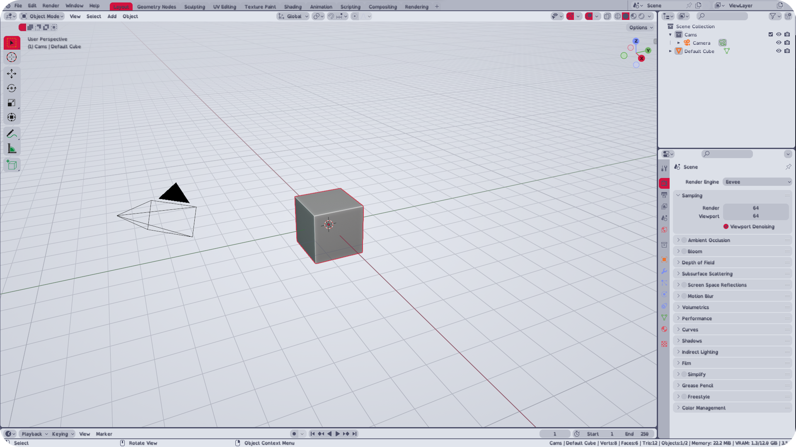
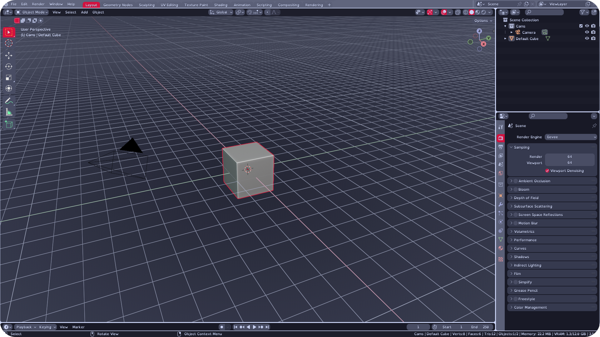
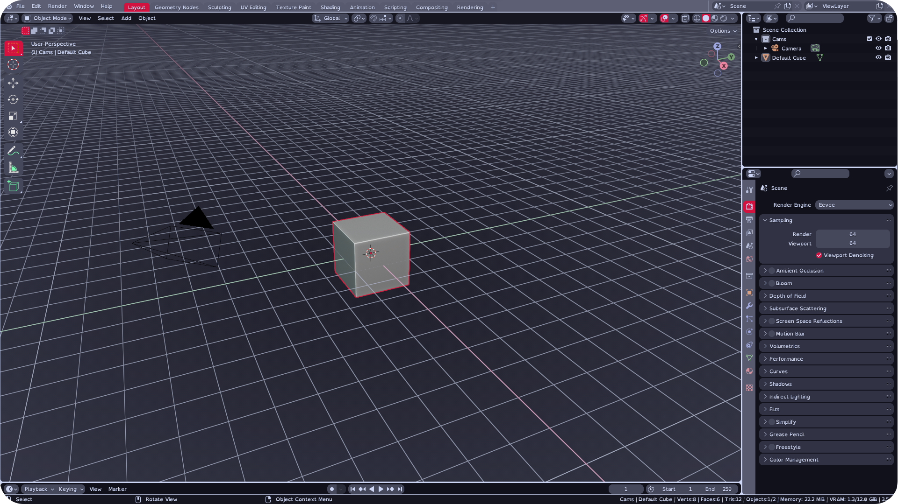

<h3 align="center">
     
    
    Catppuccin for <a href="https://github.com/catppuccin/template">Blender</a>
    
</h3>

    
    
    

    

## Previews

? Latte

? Frapp?

? Macchiato

? Mocha

## Usage

1. Clone this repository locally
2. (Optional) Customize accents
3. Open Blender's settings: `Edit Å® Preferences Å® Themes Å® Install`. Browse to where you cloned Catppuccin and install the `.xml` file of your selected flavor.
4. This copies the theme into `./scripts/presets/interface_theme/` subdirectory of your Blender [configuration directory](https://docs.blender.org/manual/en/latest/advanced/blender_directory_layout.html). You may now select it from the drop down menu.

<!-- this section is optional -->

## Important information

This project started with a need for a better light theme for Blender, as the default one is quite ugly. As such, I used the Latte color palette to handcraft the light theme.

The Frapp?, Macchiato and Mocha palettes were generated by the [Puccinier](https://github.com/catppuccin/toolbox#%EF%B8%8F-puccinier) script. This means that these three dark themes may be inconsistent in their design.

Made for Blender 3.5.

## ?FAQ

- Q: **_"How do I customize accents?"_**
  A: Open your flavor's `.xml` file in any text editor. Find and Replace the following two colors with colors of your choice (maybe use another color for your flavor from the [Catppuccin palette](https://github.com/catppuccin/catppuccin#-palette)):
  Primary accent, visible on most UI elements: `#D3123F`
  Secondary accent, visible only when selecting multiple objects/vertices/other elements: `#9C0D2F`

&nbsp;

    

    Copyright ? 2021-present <a href="https://github.com/catppuccin" target="_blank">Catppuccin Org</a>

    

