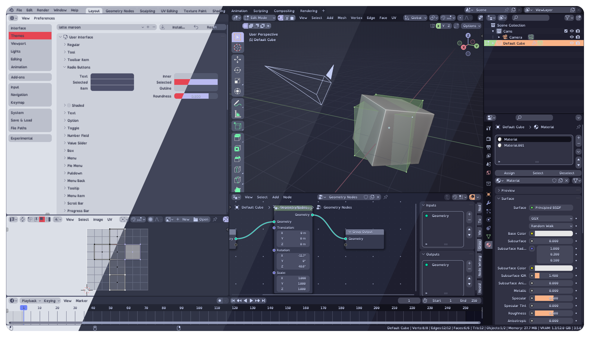
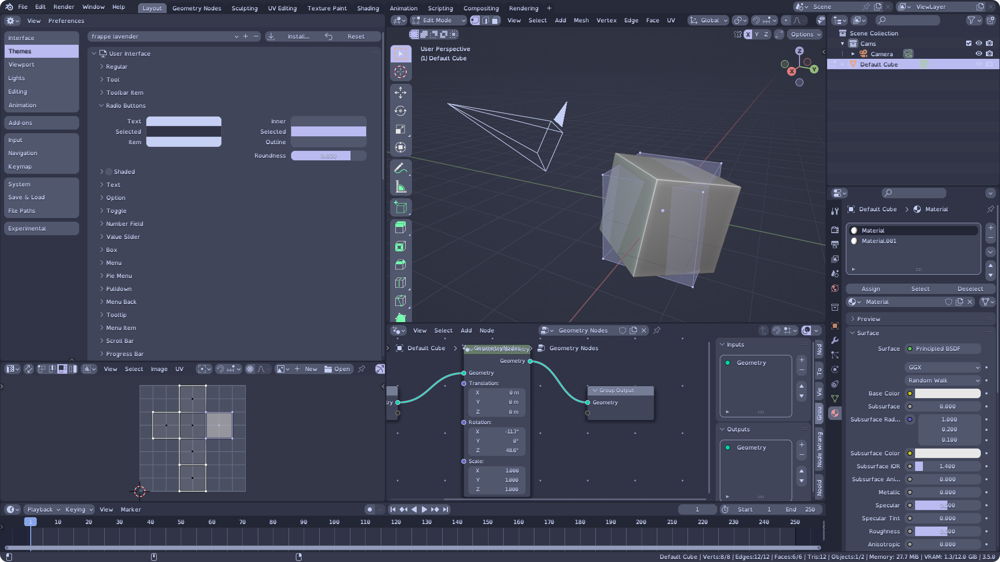
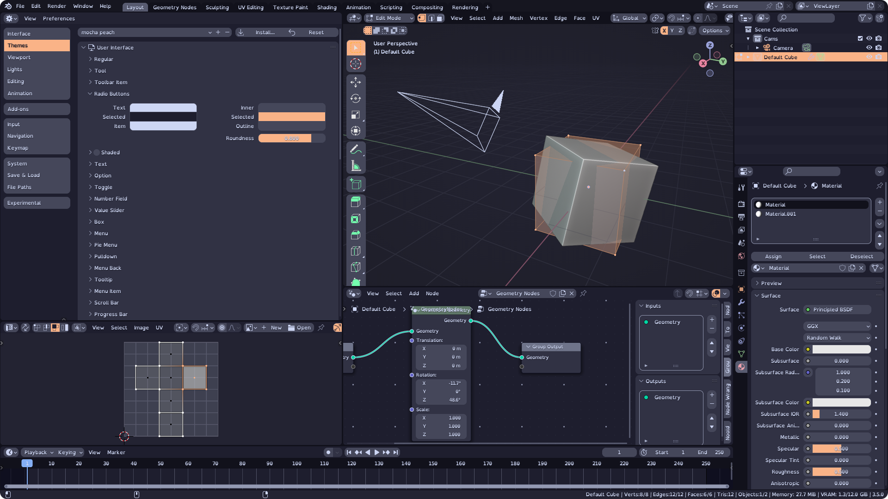

<h3 align="center">
     
    
    Catppuccin for <a href="https://www.blender.org/">Blender</a>
    
</h3>

    
    
    

    

## 📷 Previews and accents

🌻 Latte

&nbsp;

🪴 Frappé

&nbsp;

🌺 Macchiato

&nbsp;

🌿 Mocha

&nbsp;

## ⬇️ Usage

1. Head over to the [latest release](https://github.com/Dalibor-P/blender/releases/latest) and download your selected accented flavour.
2. Open Blender's settings and theme installation dialogue: `Edit → Preferences → Themes → Install`.
3. Browse to where you downloaded the theme and install the `.xml` file.
4. This copies the theme into `./scripts/presets/interface_theme/` subdirectory of your Blender [configuration directory](https://docs.blender.org/manual/en/latest/advanced/blender_directory_layout.html). You may now select it from the drop down menu.

Made for Blender 3.5+. You can try my add-on [Theme Swapper](https://github.com/Dalibor-P/Theme-Swapper) to quickly swap between light and dark themes.

## ❓ FAQ

**Q: Custom Panel/Box/Button roundness? Custom accent colour?**

A: Clone or download the repository locally. If you don't have python, open your desired flavour master files in any text editor (for example `accent generator/latte_master.xml`). Find and replace following text:

1. `roundness="0.8"` replace for your desired element roundness. For example, `roundness="0.4"` is Blender Dark default.
2. `#bada55` replace for your custom accent colour, that will show on many UI elements. For example `#ad75f5` is light mauve.
3. `#bada66` replace for your custom secondary accent colour, that will show when selecting multiple objects. For example `#563a7a` is dark mauve.

If you have python, run `accent generator/accent generator.py` with arguments of your choice. All files in `themes/` will be regenerated for all four flavours. You need colorutils installed (`pip install colorutils`). Examples:

* `python 'accent generator.py' '0.4' 'All'` will generate all default accents with roundness of 0.4 which is Blender Dark default roundness.
* `python 'accent generator.py' '#E64553' '1'` will generate only custom maroon accent with maximum roundness.
* `python 'accent generator.py' 'all' '0.1' '#ff0000'` will generate all default accents as well as a custom red accent, all with roundness of 0.1.

**Q: I have contrast issues with accent X!**

A: Raise an issue and propose an alternative accent colour.

**Q: Well, you see, I think that ...**

A: Others have made Catppuccin themes for Blender as well. You might like their versions too:

* [Catppuccin by Ameknite](https://github.com/ameknite/blender) is a well done dark theme inspired by Blenders default dark theme.
* [Catppuccin by codekisser](https://github.com/codekisser/blender) is another well done dark theme.
* [Catppuccin by nekowinston](https://github.com/nekowinston/ctp-blender) appears to be build on an older version of Catppuccin, and no longer maintained.

[Catppuccin team](https://github.com/catppuccin) has not yet selected one particular implementation as official.

## 👐 Contributing

* Report any inconsistencies, flaws, mistakes or contrast issues you can find.
* Propose alternative accent colours for better contrast between foreground and background elements.

## 💝 Thanks to

- [Dalibor-P](https://github.com/Dalibor-P)
- [Ameknite](https://github.com/ameknite)

&nbsp;

    

    Copyright &copy; 2021-present <a href="https://github.com/catppuccin" target="_blank">Catppuccin Org</a>

    

