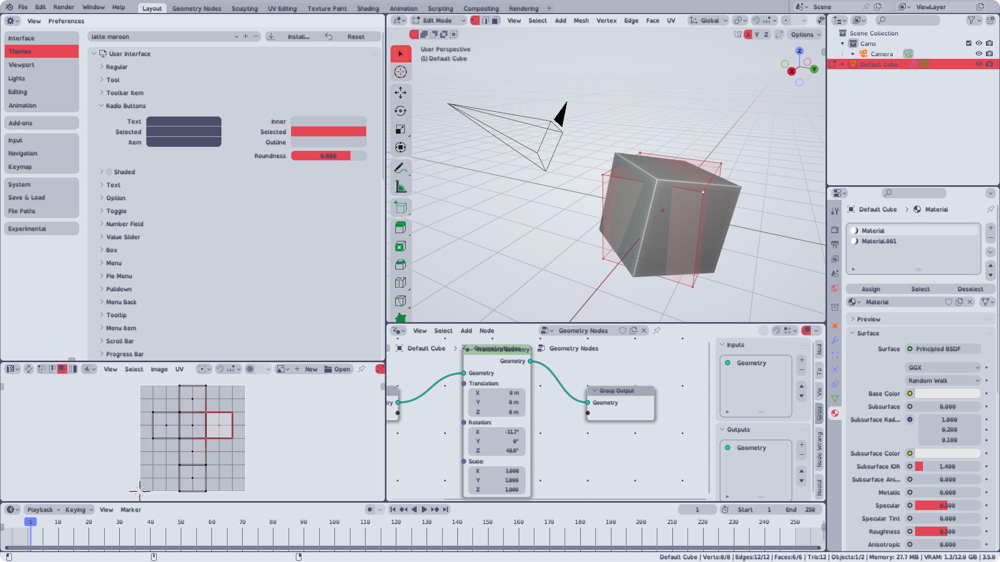
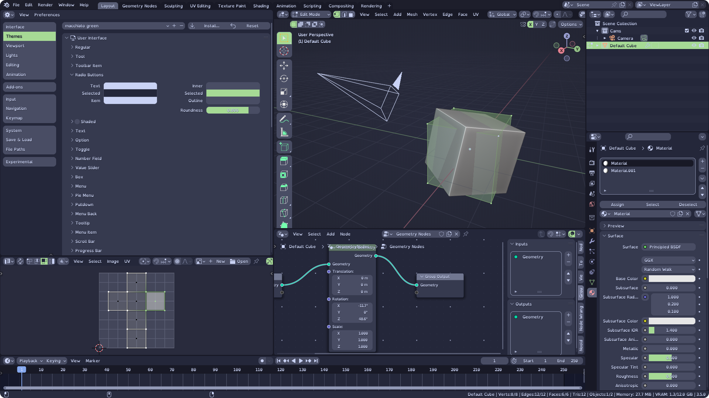

<h3 align="center">
     
    
    Catppuccin for <a href="https://www.blender.org/">Blender</a>
    
</h3>

    
    
    

    

## 📷 Previews and accents

🌻 Latte

&nbsp;

🪴 Frappé

&nbsp;

🌺 Macchiato

&nbsp;

🌿 Mocha

&nbsp;

## ⬇️ Usage

Made for Blender 3.5.

1. Clone or download this repository locally.
2. Open Blender's settings and theme installation dialog: `Edit → Preferences → Themes → Install`.
3. Browse to where you downloaded Catppuccin and open the `themes` directory. Install the `.xml` file of your chosen flavor and accent.
4. This copies the theme into `./scripts/presets/interface_theme/` subdirectory of your Blender [configuration directory](https://docs.blender.org/manual/en/latest/advanced/blender_directory_layout.html). You may now select it from the drop down menu.

## ❓ FAQ

**Q: Panel/Box/Button roundness?**

A: You can either clone the repository locally and run `accent generator/accent generator.py` and regenerate all themes with custom roundness. Or you can open your downloaded theme in any text editor, search for `roundness="0.8"` and replace the number. Blender default is `0.4`.

**Q: I have contrast issues with accent X!**

A: Yeah I know. The accent colors are from [Catppuccin palette itself](https://github.com/catppuccin/catppuccin#-palette). Raise an issue and propose an alternative accent color.

**Q: Well, you see, I think that ...**

A: Others have already made Catpuccin themes for Blender. You might like their versions too: [Catppuccin by Ameknite](https://github.com/ameknite/blender), [Catppuccin by codekisser](https://github.com/codekisser/blender) and [Catppuccin by nekowinston](https://github.com/nekowinston/ctp-blender). [Catppuccin team](https://github.com/catppuccin) has not yet selected one particular implementation as official.

## 👐 Contributing

* Report any inconsistencies, flaws, mistakes or contrast issues you can find.
* Propose alternative accent colors for better contrast between foreground and background elements.

## 💝 Thanks to

- [Dalibor-P](https://github.com/Dalibor-P)
- [Ameknite](https://github.com/ameknite)

&nbsp;

    

    Copyright &copy; 2021-present <a href="https://github.com/catppuccin" target="_blank">Catppuccin Org</a>

    

